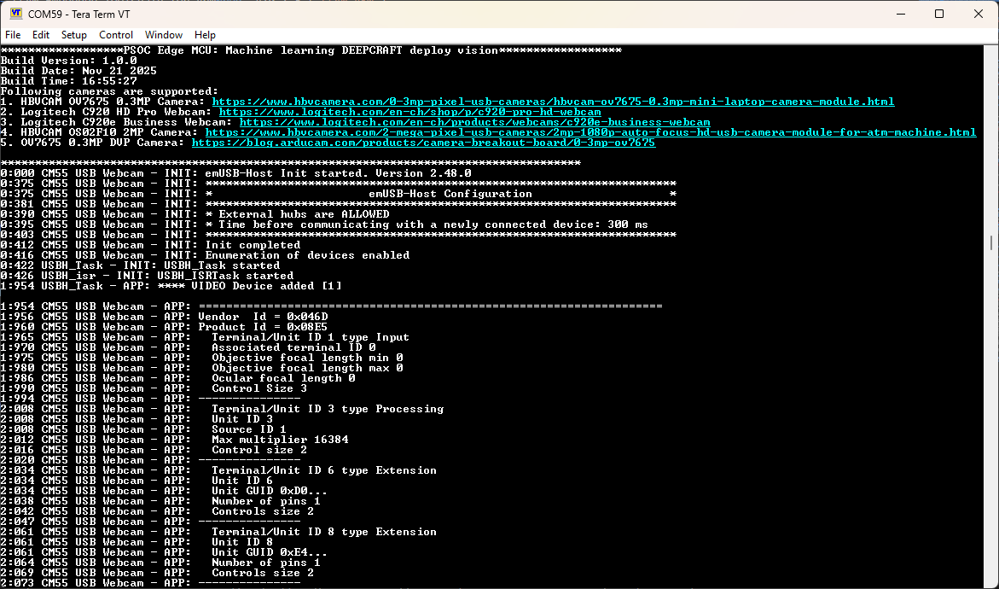
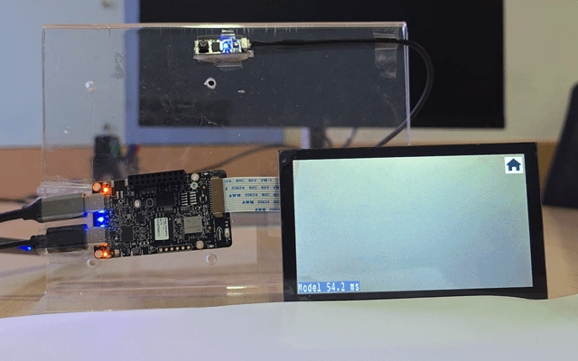
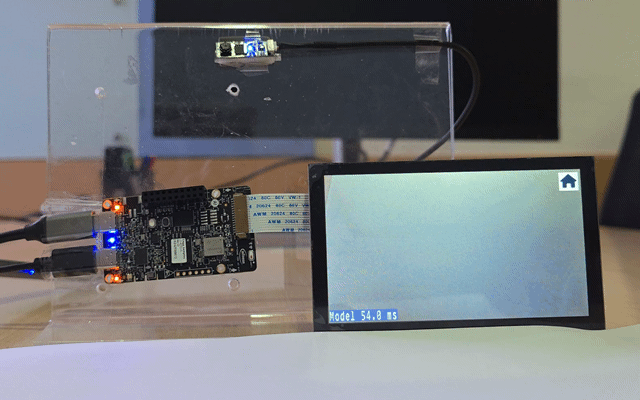
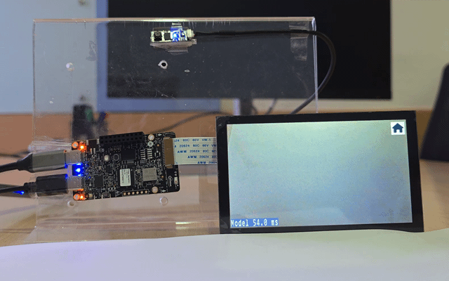
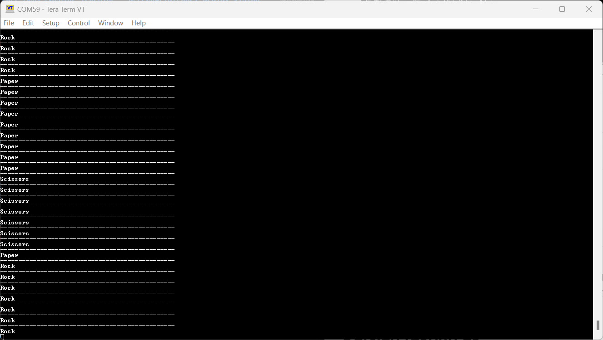

# PSOC&trade; Edge MCU: Machine learning – DEEPCRAFT&trade; deploy vision

This code example demonstrates a real-time hand gesture detection that uses a USB camera to capture live video and a DEEPCRAFT&trade; Studio object detection model to detect hand gestures (rock, paper, or scissors) in the video feed using ModusToolbox&trade;. The detected gestures are highlighted by drawing a bounding box around the gesture and displaying the corresponding text (rock, paper, or scissors) in a text box on the display and on a terminal.

This code example has a three-project structure: CM33 secure, CM33 non-secure, and CM55 projects. All three projects are programmed to the external QSPI flash and executed in Execute in Place (XIP) mode. Extended boot launches the CM33 secure project from a fixed location in the external flash, which then configures the protection settings and launches the CM33 non-secure application. Additionally, CM33 non-secure application enables CM55 CPU and launches the CM55 application.

[View this README on GitHub.](https://github.com/Infineon/mtb-example-psoc-edge-ml-deepcraft-deploy-vision)

[Provide feedback on this code example.](https://yourvoice.infineon.com/jfe/form/SV_1NTns53sK2yiljn?Q_EED=eyJVbmlxdWUgRG9jIElkIjoiQ0UyNDIxNDUiLCJTcGVjIE51bWJlciI6IjAwMi00MjE0NSIsIkRvYyBUaXRsZSI6IlBTT0MmdHJhZGU7IEVkZ2UgTUNVOiBNYWNoaW5lIGxlYXJuaW5nIOKAkyBERUVQQ1JBRlQmdHJhZGU7IGRlcGxveSB2aXNpb24iLCJyaWQiOiJzYW5kZWVwLmFrQGluZmluZW9uLmNvbSIsIkRvYyB2ZXJzaW9uIjoiMi4yLjAiLCJEb2MgTGFuZ3VhZ2UiOiJFbmdsaXNoIiwiRG9jIERpdmlzaW9uIjoiTUNEIiwiRG9jIEJVIjoiSUNXIiwiRG9jIEZhbWlseSI6IlBTT0MifQ==)

See the [Design and implementation](docs/design_and_implementation.md) for the functional description of this code example.

## Requirements

- [ModusToolbox&trade;](https://www.infineon.com/modustoolbox) v3.7 or later (tested with v3.7)
- Board support package (BSP) minimum required version: 1.0.0
- Programming language: C
- Associated parts: All [PSOC&trade; Edge MCU](https://www.infineon.com/products/microcontroller/32-bit-psoc-arm-cortex/32-bit-psoc-edge-arm) parts

## Supported toolchains (make variable 'TOOLCHAIN')

- GNU Arm&reg; Embedded Compiler v14.2.1 (`GCC_ARM`) – Default value of `TOOLCHAIN`
- LLVM Embedded Toolchain for Arm&reg; v19.1.5 (`LLVM_ARM`)

> **Notes:**
> - IAR is not supported by the TensorFlow Lite for Microcontrollers (TFLM) library
> - This code example fails to build in RELEASE mode with the `GCC_ARM` toolchain v14.2.1 as it does not recognize some of the Helium instructions of the CMSIS-DSP library. This issue is not present in the Arm&reg; Compiler for Embedded (armclang)
> - This code example currently supports the VFP_SELECT option "hardfp" only. Setting "softfp" may cause build failure.

## Supported kits (make variable 'TARGET')

- [PSOC&trade; Edge E84 Evaluation Kit](https://www.infineon.com/KIT_PSE84_EVAL) (`KIT_PSE84_EVAL_EPC2`) – Default value of `TARGET`
- [PSOC&trade; Edge E84 AI Kit](https://www.infineon.com/KIT_PSE84_AI) (`KIT_PSE84_AI`)

## Hardware setup

This example uses the board's default configuration. See the kit user guide to ensure that the board is configured correctly.

Ensure the following jumper and pin configuration on board.
- BOOT SW must be in the HIGH/ON position
- J20 and J21 must be in the tristate/not connected (NC) position for the PSOC&trade; Edge E84 Evaluation Kit

> **Note:** This hardware setup is not required for the KIT_PSE84_AI kit.

While using DVP Camera with PSOC&trade; Edge E84 AI Kit, refer to the [PSOC&trade; Edge E84 AI Kit guide](https://www.infineon.com/assets/row/public/documents/30/44/infineon-kit-pse84-ai-user-guide-usermanual-en.pdf) for instructions on connecting the camera module.

### Supported camera and display

- Connect any of the following cameras to the USB host port on the kit
  - [HBVCAM OV7675 0.3MP MINI Camera](https://www.hbvcamera.com/0-3mp-pixel-usb-cameras/hbvcam-ov7675-0.3mp-mini-laptop-camera-module.html)  
  - [Logitech C920 HD Pro Webcam](https://www.logitech.com/en-ch/shop/p/c920-pro-hd-webcam)  
  - [Logitech C920e Business Webcam](https://www.logitech.com/en-ch/products/webcams/c920e-business-webcam)  
  - [HBVCAM OS02F10 2MP Camera](https://www.hbvcamera.com/2-mega-pixel-usb-cameras/2mp-1080p-auto-focus-hd-usb-camera-module-for-atm-machine.html)  

- The PSOC&trade; Edge AI Kit also supports -
  - [OV7675 0.3MP DVP Camera module](https://blog.arducam.com/products/camera-breakout-board/0-3mp-ov7675)  

  > **Note:** To enable the DVP Camera, update the value of `CAMERA_TYPE` variable in the Makefile of CM55 project from `CAM_USB` to `CAM_DVP`.

> **Note:** For any USB camera other than the ones listed above, ensure that the vendor ID  and product ID of the camera being used are correctly configured in the *usb_camera_task.c* and *usb_camera_task.h* file.

- **Waveshare 4.3 inch Raspberry Pi DSI 800 x 480 display:**  
  Connect the FPC 15-pin cable between the display connector and the PSOC&trade; Edge E84's RPI MIPI DSI connector as outlined in **Table 1** and **Figure 1**

   **Table 1. Cable connection between display connect and kit**

   Kit's name                                      | DSI connector
   ----------------------------------------------- | --------------
   PSOC&trade; Edge E84 Evaluation Kit             | J39
   PSOC&trade; Edge E84 AI Kit                     | J10

    

  **Figure 1. Display connection with PSOC&trade; Edge E84 Evaluation Kit**

  

## Software setup

See the [ModusToolbox&trade; tools package installation guide](https://www.infineon.com/ModusToolboxInstallguide) for information about installing and configuring the tools package.

Install a terminal emulator if you do not have one. Instructions in this document use [Tera Term](https://teratermproject.github.io/index-en.html).

Install the [ModusToolbox&trade; Machine Learning Pack](https://softwaretools.infineon.com/tools/com.ifx.tb.tool.modustoolboxpackmachinelearning) or use the [Infineon Developer Center (IDC)](https://www.infineon.com/cms/en/design-support/tools/utilities/infineon-developer-center-idc-launcher/) launcher and search for "ModusToolbox Machine Learning Pack" and install it.

This example requires no additional software or tools.

> **Note:** This code example currently does not work with the custom BSP name for the `KIT_PSE84_EVAL_EPC2` and `KIT_PSE84_AI` kits. If you want to change the BSP name to a non-default value, ensure to update the custom BSP name in *Makefile* under the relevant section. The build fails if you do not update the custom BSP name.

## Operation

See [Using the code example](docs/using_the_code_example.md) for instructions on creating a project, opening it in various supported IDEs, and performing tasks, such as building, programming, and debugging the application within the respective IDEs.

1. Connect the board to your PC using the provided USB cable through the KitProg3 USB connector

2. Open a terminal program and select the KitProg3 COM port. Set the serial port parameters to 8N1 and 115200 baud

3. Connect the USB camera to the kit's USB host port and display as mentioned in the [Supported camera and display](#supported-camera-and-display) section

4. After programming, the application starts automatically. Confirm that "PSOC Edge MCU: Machine learning DEEPCRAFT deploy vision" is displayed on the UART terminal and the kit will start capturing video from the USB camera

   **Figure 2. Terminal output on program startup for deploy vision**

   

5. Perform hand gestures (rock, paper, or scissors) in front of the camera

6. The display will show the live video feed with bounding boxes and labels for detected gestures

   **Figure 3. Display output for recognized hand gestures**

   **Rock gesture detection** | **Paper gesture detection** | **Scissors gesture detection**
   ------------------------| ------------------------| ------------------------
    |  | 

   

7. Labels for the detected hand gesture is displayed on the UART terminala

   **Figure 4. Terminal output on gesture detection for deploy vision**

   

   

The code example can be updated to use other starter models from DEEPCRAFT&trade; Studio. For more information, see [Deploy vision model on PSOC&trade; 6 and PSOC&trade; Edge boards](https://developer.imagimob.com/deepcraft-studio/deployment/deploy-models-supported-boards/deploy-vision-model-PSOC-Edge). For details on generating, optimizing, and validating the model code using DEEPCRAFT&trade; Studio, see [Code generation for Infineon boards](https://developer.imagimob.com/deepcraft-studio/code-generation/code-gen-infineon-boards).

> **Note:** The vision model provided in this example is not production ready and is provided here for reference purpose only. You can develop your own models in DEEPCRAFT&trade; Studio and use this example to deploy them on PSOC&trade; Edge MCU by replacing the corresponding .c/.h files.

## Related resources

Resources  | Links
-----------|----------------------------------
Application notes  | [AN235935](https://www.infineon.com/AN235935) – Getting started with PSOC&trade; Edge E8 MCU on ModusToolbox&trade; software
Code examples  | [Using ModusToolbox&trade;](https://github.com/Infineon/Code-Examples-for-ModusToolbox-Software) on GitHub
Device documentation | [PSOC&trade; Edge MCU datasheets](https://www.infineon.com/products/microcontroller/32-bit-psoc-arm-cortex/32-bit-psoc-edge-arm#documents)   [PSOC&trade; Edge MCU reference manuals](https://www.infineon.com/products/microcontroller/32-bit-psoc-arm-cortex/32-bit-psoc-edge-arm#documents)
Development kits | Select your kits from the [Evaluation board finder](https://www.infineon.com/cms/en/design-support/finder-selection-tools/product-finder/evaluation-board)
Libraries  | [mtb-dsl-pse8xxgp](https://github.com/Infineon/mtb-dsl-pse8xxgp) – Device support library for PSE8XXGP   [retarget-io](https://github.com/Infineon/retarget-io) – Utility library to retarget STDIO messages to a UART port
Tools  | [ModusToolbox&trade;](https://www.infineon.com/modustoolbox) – ModusToolbox&trade; software is a collection of easy-to-use libraries and tools enabling rapid development with Infineon MCUs for applications ranging from wireless and cloud-connected systems, edge AI/ML, embedded sense and control, to wired USB connectivity using PSOC&trade; Industrial/IoT MCUs, AIROC&trade; Wi-Fi and Bluetooth&reg; connectivity devices, XMC&trade; Industrial MCUs, and EZ-USB&trade;/EZ-PD&trade; wired connectivity controllers. ModusToolbox&trade; incorporates a comprehensive set of BSPs, HAL, libraries, configuration tools, and provides support for industry-standard IDEs to fast-track your embedded application development

 

## Other resources

Infineon provides a wealth of data at [www.infineon.com](https://www.infineon.com) to help you select the right device, and quickly and effectively integrate it into your design.

## Document history

Document title: *CE242145* – *PSOC&trade; Edge MCU: DEEPCRAFT&trade; deploy vision*

 Version | Description of change
 ------- | ---------------------
 1.0.0   | New code example
 2.0.0   | Updated to work with latest DEEPCRAFT&trade;
 2.0.1   | README update to include instructions for enabling DVP Camera
 2.1.0   | Updated design files to fix ModusToolbox&trade; v3.7 build warnings
 2.2.0   | Enabled 24 MHz EXT_CLK to reduce USB camera transaction errors
 

All referenced product or service names and trademarks are the property of their respective owners.

The Bluetooth&reg; word mark and logos are registered trademarks owned by Bluetooth SIG, Inc., and any use of such marks by Infineon is under license.

PSOC&trade;, formerly known as PSoC&trade;, is a trademark of Infineon Technologies. Any references to PSoC&trade; in this document or others shall be deemed to refer to PSOC&trade;.

---------------------------------------------------------

© Cypress Semiconductor Corporation, 2025-2026. This document is the property of Cypress Semiconductor Corporation, an Infineon Technologies company, and its affiliates ("Cypress").  This document, including any software or firmware included or referenced in this document ("Software"), is owned by Cypress under the intellectual property laws and treaties of the United States and other countries worldwide.  Cypress reserves all rights under such laws and treaties and does not, except as specifically stated in this paragraph, grant any license under its patents, copyrights, trademarks, or other intellectual property rights.  If the Software is not accompanied by a license agreement and you do not otherwise have a written agreement with Cypress governing the use of the Software, then Cypress hereby grants you a personal, non-exclusive, nontransferable license (without the right to sublicense) (1) under its copyright rights in the Software (a) for Software provided in source code form, to modify and reproduce the Software solely for use with Cypress hardware products, only internally within your organization, and (b) to distribute the Software in binary code form externally to end users (either directly or indirectly through resellers and distributors), solely for use on Cypress hardware product units, and (2) under those claims of Cypress's patents that are infringed by the Software (as provided by Cypress, unmodified) to make, use, distribute, and import the Software solely for use with Cypress hardware products.  Any other use, reproduction, modification, translation, or compilation of the Software is prohibited.
 
TO THE EXTENT PERMITTED BY APPLICABLE LAW, CYPRESS MAKES NO WARRANTY OF ANY KIND, EXPRESS OR IMPLIED, WITH REGARD TO THIS DOCUMENT OR ANY SOFTWARE OR ACCOMPANYING HARDWARE, INCLUDING, BUT NOT LIMITED TO, THE IMPLIED WARRANTIES OF MERCHANTABILITY AND FITNESS FOR A PARTICULAR PURPOSE.  No computing device can be absolutely secure.  Therefore, despite security measures implemented in Cypress hardware or software products, Cypress shall have no liability arising out of any security breach, such as unauthorized access to or use of a Cypress product. CYPRESS DOES NOT REPRESENT, WARRANT, OR GUARANTEE THAT CYPRESS PRODUCTS, OR SYSTEMS CREATED USING CYPRESS PRODUCTS, WILL BE FREE FROM CORRUPTION, ATTACK, VIRUSES, INTERFERENCE, HACKING, DATA LOSS OR THEFT, OR OTHER SECURITY INTRUSION (collectively, "Security Breach").  Cypress disclaims any liability relating to any Security Breach, and you shall and hereby do release Cypress from any claim, damage, or other liability arising from any Security Breach.  In addition, the products described in these materials may contain design defects or errors known as errata which may cause the product to deviate from published specifications. To the extent permitted by applicable law, Cypress reserves the right to make changes to this document without further notice. Cypress does not assume any liability arising out of the application or use of any product or circuit described in this document. Any information provided in this document, including any sample design information or programming code, is provided only for reference purposes.  It is the responsibility of the user of this document to properly design, program, and test the functionality and safety of any application made of this information and any resulting product.  "High-Risk Device" means any device or system whose failure could cause personal injury, death, or property damage.  Examples of High-Risk Devices are weapons, nuclear installations, surgical implants, and other medical devices.  "Critical Component" means any component of a High-Risk Device whose failure to perform can be reasonably expected to cause, directly or indirectly, the failure of the High-Risk Device, or to affect its safety or effectiveness.  Cypress is not liable, in whole or in part, and you shall and hereby do release Cypress from any claim, damage, or other liability arising from any use of a Cypress product as a Critical Component in a High-Risk Device. You shall indemnify and hold Cypress, including its affiliates, and its directors, officers, employees, agents, distributors, and assigns harmless from and against all claims, costs, damages, and expenses, arising out of any claim, including claims for product liability, personal injury or death, or property damage arising from any use of a Cypress product as a Critical Component in a High-Risk Device. Cypress products are not intended or authorized for use as a Critical Component in any High-Risk Device except to the limited extent that (i) Cypress's published data sheet for the product explicitly states Cypress has qualified the product for use in a specific High-Risk Device, or (ii) Cypress has given you advance written authorization to use the product as a Critical Component in the specific High-Risk Device and you have signed a separate indemnification agreement.
 
Cypress, the Cypress logo, and combinations thereof, ModusToolbox, PSoC, CAPSENSE, EZ-USB, F-RAM, and TRAVEO are trademarks or registered trademarks of Cypress or a subsidiary of Cypress in the United States or in other countries. For a more complete list of Cypress trademarks, visit www.infineon.com. Other names and brands may be claimed as property of their respective owners.